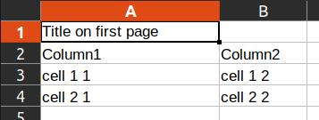
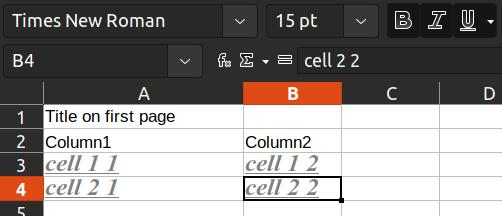
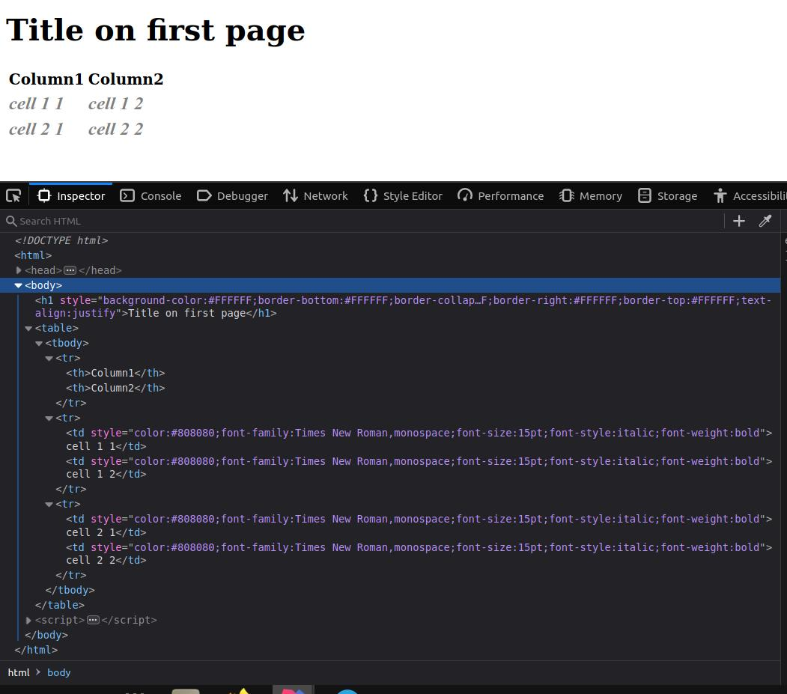
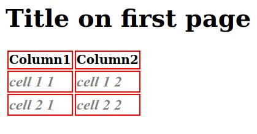
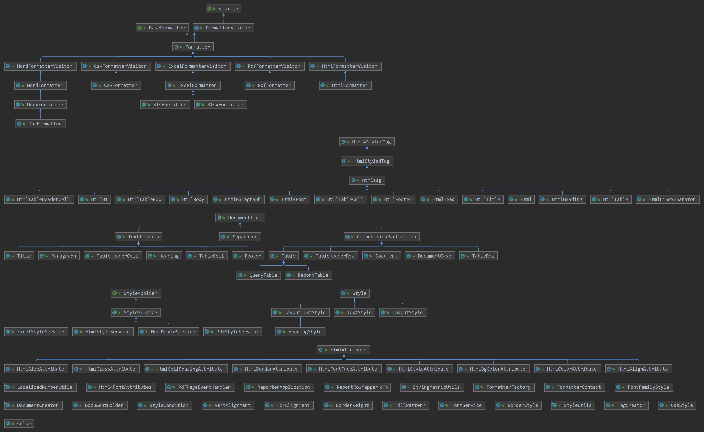

# Reporter

Simple package aimed to write SQL database to resource. Available output formats:

html, pdf<font size=2><sup id="a1">[1](#f1)</sup></font>, xls, xlsx, doc<font size=2><sup id="a2">[2](#f2)</sup></font>,
docx, csv
\
\
To start just add folder "reporter" to your project.

|       Dependencies       |      Usage      |
|:------------------------:|:---------------:|
|   org.springframework    |                 |
| org.springframework.boot |                 |
|       com.itextpdf       |       pdf       |
|      org.apache.poi      | xls, xlsx, docx |
|     com.documents4j      |       doc       |
|     net.sf.supercsv      |       scv       |
|        org.slf4j         |     logging     |
|     com.google.guava     |   toString()    |


Documentation in progress.

## Example

```java 
//Document will be saved in a new file "Document name.xlsx"
final var doc =
    Document.create()
        .setLabel("Document name")
        .addParts(
            Title.create("Title on first page"),
            Table.create(
                    TableHeaderRow.create(
                        TableHeaderCell.create("Column1"),
                        TableHeaderCell.create("Column2")
                    )
                )
                .addParts(
                    TableRow.create(
                        TableCell.create("cell 1 1"),
                        TableCell.create("cell 1 2")
                    ),
                    TableRow.create(
                        TableCell.create("cell 2 1"),
                        TableCell.create("cell 2 2")
                    ) 
                )
        );
//Creating appropriate formatter
final var xlsxFormatter = XlsxFormatter.create();
//DocumentHolder as AutoCloseable will be holding our file "Document name.xlsx"
try (var documentHolder = xlsxFormatter.handle(doc)) {
    var file = documentHolder.getResource().getFile();
    //Any stuff with file here
} catch (Throwable t) {
    
}
```

results in


Let's adjust cell width for our Title:

```java
...
    Title.create("Title on first page")
    .setStyle(
    LayoutStyle.create()
    .setAutoWidth(true)
    ),
    ...
```



Now let's add text style to table row cells:

```java
...
Table.create(
    TableHeaderRow.create(
       TableHeaderCell.create("Column1"),
       TableHeaderCell.create("Column2")
       )
    )
    .addParts(
       TableRow.create(
          TableCell.create("cell 1 1"),
          TableCell.create("cell 1 2")
       ),
       TableRow.create(
          TableCell.create("cell 2 1"),
          TableCell.create("cell 2 2")
       )
    )
    .spreadStyleToParts(                         //spreading style to table rows and their cells
       TextStyle.create("Times New Roman")
          .setBold(true)
          .setItalic(true)
          .setUnderline((byte)1)
          .setFontSize((short)15)
          .setColor(Color.GREY)
    )
...
```


We can put Document to HtmlFormatter:
```java
...
final var htmlFormatter = HtmlFormatter.create();
try (var documentHolder = htmlFormatter.handle(doc)) {
    var file = documentHolder.getResource().getFile();
} catch (Throwable t) {}
...
```
And get result



Styles are written in each html-element because we assign them directly to elements through
setStyle() or spreadStyleToParts(). It is convenient when using html4 specification.
But in html5 with [StyleService](src/main/java/com/reporter/domain/styles/StyleService.java) 
using they will be written in header section with unique indexes.

Ok, it seems we need some table borders:
```java
...
final var bordersStyle = LayoutStyle.create()
   .setBorderTop(BorderStyle.create(Color.RED, BorderWeight.MEDIUM))
   .setBorderLeft(BorderStyle.create(Color.RED, BorderWeight.MEDIUM))
   .setBorderRight(BorderStyle.create(Color.RED, BorderWeight.MEDIUM))
   .setBorderBottom(BorderStyle.create(Color.RED, BorderWeight.MEDIUM));
...
    Table.create(
           TableHeaderRow.create(
              TableHeaderCell.create("Column1"),
              TableHeaderCell.create("Column2")
           )
           .spreadStyleToParts(bordersStyle)
        )
        .addParts(
            ...
        )
        .spreadStyleToParts(
           LayoutTextStyle.create(
              TextStyle.create("Times New Roman")
                 .setBold(true)
                 .setItalic(true)
                 .setUnderline((byte) 1)
                 .setFontSize((short) 15)
                 .setColor(Color.GREY),
              bordersStyle
            )
        )
```


Same result, but using StyleService:
```java
        final var titleStyle =
            LayoutStyle.create()
                .setAutoWidth(true)
                .setCondition(StyleCondition.create(null, Title.class));

        final var bordersStyle =
            LayoutStyle.create()
                .setBorderTop(BorderStyle.create(Color.RED, BorderWeight.MEDIUM))
                .setBorderLeft(BorderStyle.create(Color.RED, BorderWeight.MEDIUM))
                .setBorderRight(BorderStyle.create(Color.RED, BorderWeight.MEDIUM))
                .setBorderBottom(BorderStyle.create(Color.RED, BorderWeight.MEDIUM))
                .setCondition(StyleCondition.create(null, TableHeaderCell.class));

        final var commonCellsStyle =
            LayoutTextStyle.create(
                    TextStyle.create("Times New Roman")
                        .setBold(true)
                        .setItalic(true)
                        .setUnderline((byte) 1)
                        .setFontSize((short) 15)
                        .setColor(Color.GREY),
                    bordersStyle.clone().setCondition(null)
                )
                .setCondition(StyleCondition.create(null, TableCell.class));

        final var styleService =
            HtmlStyleService.create()
                .addStyles(titleStyle, bordersStyle, commonCellsStyle);

        doc =
            Document.create()
                .setLabel("Document name")
                .addParts(
                    Title.create("Title on first page"),
                    Table.create(
                            TableHeaderRow.create(
                                    TableHeaderCell.create("Column1"),
                                    TableHeaderCell.create("Column2")
                                )
                        )
                        .addParts(
                            TableRow.create(
                                TableCell.create("cell 1 1"),
                                TableCell.create("cell 1 2")
                            ),
                            TableRow.create(
                                TableCell.create("cell 2 1"),
                                TableCell.create("cell 2 2")
                            )
                        )
                );

        final var htmlFormatter = HtmlFormatter.create().setStyleService(styleService);
        final var documentHolder = htmlFormatter.handle(doc);
```


Little example on how to get data from DB:

```java 
final NamedParameterJdbcTemplate jdbcTemplate = ...          //connection to db
final var html =
    Document.create()
        .setLabel("doc.html")
        .addParts(
            QueryTable.create(
                    TableHeaderRow.create(
                        TableHeaderCell.create("Traffic name").setAliasName("traffic_name_as_in_db"),
                        TableHeaderCell.create("Traffic direction").setAliasName("traffic_dir_as_in_db")
                    )
                )
                .setNamedParameterJdbcTemplate(jdbcTemplate)
        );
//Creating appropriate formatter
final var htmlFormatter = HtmlFormatter.create();
//DocumentHolder as AutoCloseable will be holding our file "doc.html"
try (var documentHolder = htmlFormatter.handle(doc)) {
    var file = documentHolder.getResource().getFile();
    //Any stuff with file here
} catch (Throwable t) {
    
}
```

The names of the columns in DB must be known in advance or flag isTableHeaderRowFromData
of [QueryTable](src/main/java/com/reporter/domain/db/QueryTable.java)
or [ReportTable](src/main/java/com/reporter/domain/ReportTable.java) must be set.

For more examples see [tests](src/test/java/com/reporter/TutorialTest.java).

What reporter can't do yet:
1) Render pictures
2) Correct render nested elements in elements (for example table in table cell)
3) E.t.c.)

#### Inner structure 

[  ](pic/classes.jpg)

## Contributing

Pull requests are welcome. For major changes, please open an issue first to discuss what you would like to change.

Please make sure to update tests as appropriate.

## License

[MIT](https://choosealicense.com/licenses/mit/)

###### Footnotes:

<b id="f1"><font size=2><sup style="color:Tomato;">1</sup></font></b>[↩](#a1)
when exporting texts with different languages to pdf format, try to use different fonts:

1) Add appropriate .ttf file to [free_fonts](src/main/resources/free_fonts)
   folder and set it to text style as in example:

```java 
...
fontService
    .initializeFonts();                                     //read all fonts and available locales from resources 
...
textStyle1
    .getTextStyle()
    .setFontNameResource("xiaolai_Monospaced_(en-zh).ttf")  //set font name 
    .setFontFamilyStyle(FontFamilyStyle.MONOSPACED);        //set fontFamily class
    .setFontLocale("zh")                                    //optionally set font locale
    
...
Document
    .create()
    .addParts(
        Title.create("一些文字").setStyle(textStyle1)
    );    
```

The font file name should contain
[FontFamilyStyle](src/main/java/com/reporter/domain/styles/FontFamilyStyle.java) name
embracing in "_", like those in [free_fonts](src/main/resources/free_fonts) folder

2) Add language (necessary) and its alphabet (optionally) to
   [free_fonts/alphabets.properties](src/main/resources/free_fonts/alphabets.properties), for instance:

```java 
pl=aąbcćdeęfghijklłmnńoópqrsśtuvwxyzźż
zh=
```

<b id="f2"><font size=2><sup style="color:Tomato;">2</sup></font></b>[↩](#a2)
.doc file retrieves from .docx through local or remote [documents4j](https://documents4j.com)
converters:
<font size=2>
> The MS Word converter is represented by a MicrosoftWordBridge instance. This bridge starts MS Word when the connected
> LocalConverter is started an quits Word once the local converter is shut down. Note that this implies that only a
> single
> active LocalConverter instance must exist not only for a JVM but for the entire physical machine. Otherwise, MS Word
> might be shut down by one bridge while it is still required by another instance. This cannot be controlled by
> documents4j but must be assured by its user. Also, make sure not to use MS Word outside a Java application while a
> MicrosoftWordBridge is active, for example by opening it from your desktop.
</font>